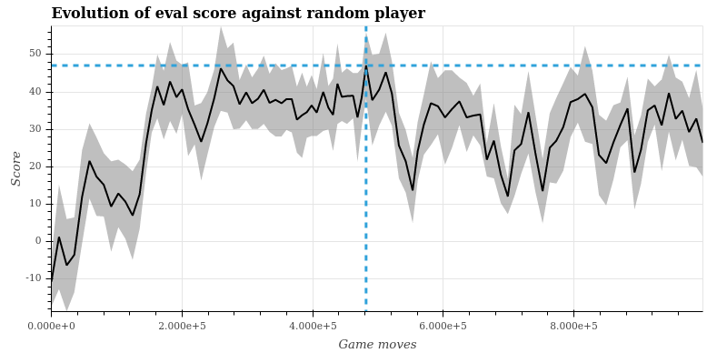

# Deep-Q Learned Player

This player was trained with Deep-Q learning, using a network with two hidden layers of size 256 each.

The graph below shows the average score
against the random player by how much games were played by the trained player:



We can see that the training starts well enough and quickly saturates around what seems like the maximum ability for this player.

Remember, the score is between -100 and +100, so our player is not a total idiot, but
not a genious either...

I've tunned the hyper-parameters quite a bit, running a random-search with 10 cases, picking the best, a second random-search with 20 cases and this is the final best set of hyper-parameters:

```
{'memory_size': 10000,
 'warm_up': 1000,
 'batch_size': 64,
 'train_every': 4,
 'epsilon': 0.85,
 'min_epsilon': 0.05,
 'epsilon_decay': 0.99999,
 'tau': 0.001,
 'gamma': 0.9,
 'lr': 1e-06,
 'gradient_clip': 0.3,
 'hidden_size': 128,
 'max_minutes': 90.0,
 'name': 'player2-05'}
 ```