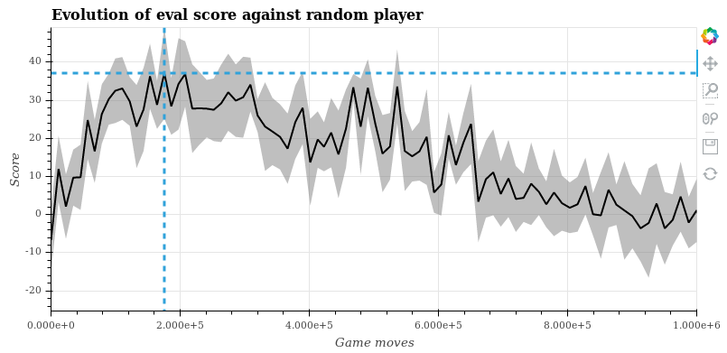

# Deep-Q Learned Player

This player was trained with Deep-Q learning, using a network with two hidden layers of size 512 each.

No tunning was done to this one, there is probably a lot of room for improvement.

The results are mild, at best and there seems to be some problem with training. The graph below shows the average score
against the random player by how much games were played by the trained player:

We can see that the training starts well enough, but gets trapped in some rather low stable point. If we zoom in, we can
check the best score: 38. Eih... Remember, the score is between -100 and +100, so our player is not a total idiot, but
not a genious either...

